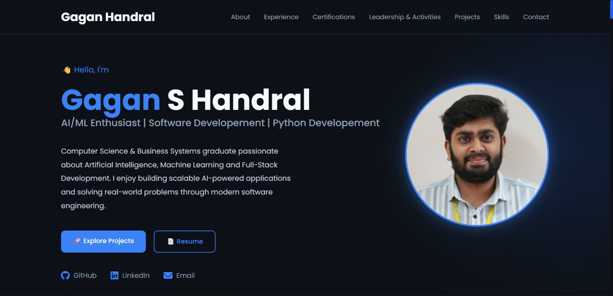

# 🌐 Gagan's Portfolio

A modern, responsive personal portfolio website showcasing my projects, skills, experience, certifications, and leadership activities.

## 📸 Preview



## 🚀 Live Demo

Coming Soon (Will be deployed on Render)

## ✨ Features

- Modern responsive UI
- Dark theme design
- Smooth scrolling navigation
- Professional hero section
- Featured projects with GitHub links
- Skills showcase
- Professional experience
- Certifications with downloadable certificates
- Leadership & extracurricular activities
- Contact section with resume download

## 🛠️ Built With

- Python
- Flask
- HTML5
- CSS3
- JavaScript
- Font Awesome

## 📂 Project Structure

```
GAGAN_PORTFOLIO/
│
├── app.py
├── requirements.txt
├── static/
│   ├── css/
│   ├── images/
│   ├── js/
│   ├── resume/
│   └── favicon.ico
│
├── templates/
│   ├── index.html
│   └── components/
│
└── README.md
```

## ⚙️ Installation

Clone the repository

```bash
git clone https://github.com/GaganHnd/GAGAN_PORTFOLIO.git
```

Navigate to the project

```bash
cd GAGAN_PORTFOLIO
```

Install dependencies

```bash
pip install -r requirements.txt
```

Run the Flask application

```bash
python app.py
```

Open your browser and visit

```
http://127.0.0.1:5000
```

## 📬 Contact

📧 Email: handralgagan@gmail.com

💼 LinkedIn: https://www.linkedin.com/in/gagan-handral

💻 GitHub: https://github.com/GaganHnd

---

Designed & Developed by **Gagan S Handral**
=======
# 🌐 Gagan's Portfolio

A modern, responsive personal portfolio website showcasing my projects, skills, experience, certifications, and leadership activities.

## 🚀 Live Demo

Coming Soon (Will be deployed on Render)

## ✨ Features

- Modern responsive UI
- Dark theme design
- Smooth scrolling navigation
- Professional hero section
- Featured projects with GitHub links
- Skills showcase
- Professional experience
- Certifications with downloadable certificates
- Leadership & extracurricular activities
- Contact section with resume download

## 🛠️ Built With

- Python
- Flask
- HTML5
- CSS3
- JavaScript
- Font Awesome

## 📂 Project Structure

```
GAGAN_PORTFOLIO/
│
├── app.py
├── requirements.txt
├── static/
│   ├── css/
│   ├── images/
│   ├── js/
│   ├── resume/
│   └── favicon.ico
│
├── templates/
│   ├── index.html
│   └── components/
│
└── README.md
```

## ⚙️ Installation

Clone the repository

```bash
git clone https://github.com/GaganHnd/GAGAN_PORTFOLIO.git
```

Navigate to the project

```bash
cd GAGAN_PORTFOLIO
```

Install dependencies

```bash
pip install -r requirements.txt
```

Run the Flask application

```bash
python app.py
```

Open your browser and visit

```
http://127.0.0.1:5000
```

## 📬 Contact

📧 Email: handralgagan@gmail.com

💼 LinkedIn: https://www.linkedin.com/in/gagan-handral

💻 GitHub: https://github.com/GaganHnd

---

Designed & Developed by **Gagan S Handral**